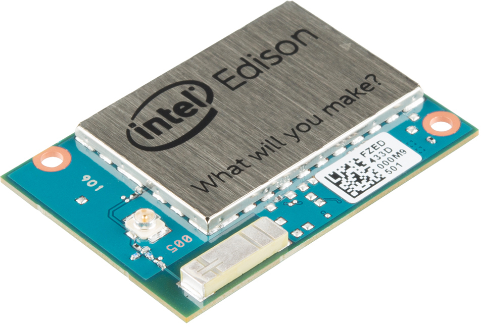

# Snake-game-for-Intel-Edison-Using-OLED-block

Make sure you have installed necessary drivers and softwares. For Windows, you have to install all USB drivers using the instructions at https://software.intel.com/en-us/get-started-edison-windows for win 64bit, https://software.intel.com/en-us/get-started-edison-windows-32 for win 32bit, https://software.intel.com/en-us/get-started-edison-linux for Linux and install TeraTerm if you are using Windows. For Linux, no need for driver, use Screen instead of TeraTerm.
1. Plug the USB cable into the Edison's Console port.
2. Set up the serial connection at Baud rate = 115200bps.
3. After you have opened up the serial port, try hitting enter a couple times. If all goes well, the Edison should respond with a login prompt. The default Edison login is root and no password.

Once you’ve loaded the code, navigate to the “oledSnake” folder and type make. Then run with command "./oled_snake".

